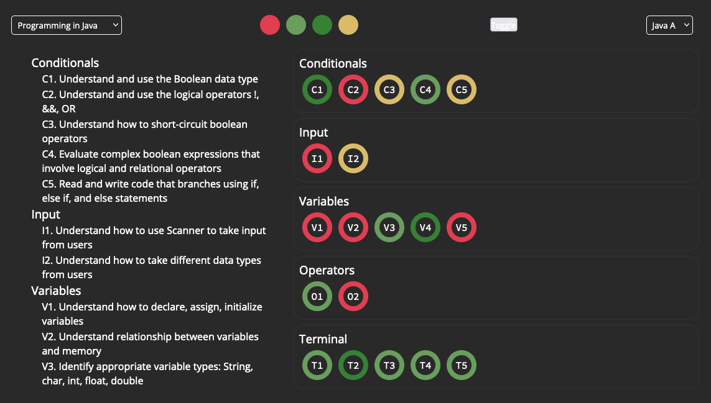

# Standards Tracker


The visualization is deployed [here](https://www.lester-lee.com/student-standards-tracker).

## Abstract
This exploratory visualization allows educators to quickly see and evaluate student masteries of standards within a course. This tool can help plan and prepare for upcoming courses; less time can be spent on topics that students have shown proficiency in, and there can be more of an emphasis on standards that students have not yet met. The cumulative course information provides a quick overview of the overall performance of a class, while the individual student view allows educators to see student performance at a more granular level.

## Data
The data for this visualization is organized into `csv` files, as follows:
```
data
|-- courses.json
`-- courses
    |-- courseA
    |   |-- roster.csv
    |   |-- standards.csv
    |   `-- students
    |       |-- studentA.csv
    |       `-- ... more students
    `-- ... more courses
```

`courses.json` contains metadata for each course; it includes information such as the course title, rosters, domains, and standards, and is used to built the aggregate visualizations.

Within `courses` is a directory for each course listed in `courses.json`; these directories contain information that is specific to the course, including a roster, a primary list of standards, and a directory of individual student information.

## Process and Reflection
As an educator, I am highly interested in how visualization tools can inform my teaching. After iterating on several different ideas, I decided to work on a tool that I could use this year for my current students.

My process centered around the features that this visualization had to include: individual masteries for individual students, overall information about the course, and the ability to select different students and courses.

After some pencil and paper sketching, I made a mock-up of how the final visualization would look using [draw.io](draw.io).


This sketch was super helpful when it came to actually writing the code for the final visualization. While the final visualization looks completely different, the overall functionality and structure remains the same.

Below is a screenshot of my project when I first started to write the code; I was experimenting with essentially all aspects of the visualization: the shapes, the colors, the placement on the page, and I wasn't quite satisfied with how it looked.



Throughout the process, I got a lot of feedback from my peers, and I'm deeply appreciative of their insights. There were many times where I was choosing between several different designs, and my peers were able to provide a variety of perspectives that I had not considered. For example, my peers had input on the formatting of the tooltip, the overall color scheme, and even the shape of how standards are visualized.

It was crucial for me to go through so many iterations of sketches and prototypes, since there was so much improvement between each one. if I were to develop my own process, that is an aspect I would definitely keep, along with frequent check-ins and critique sessions with peers.


As you can see from the preview of the final visualization, it looks drastically different from the initial sketches. I collapsed the space between each standard so now it looks more like a heatmap, and I also included additional views for course summaries and individual student information. This format is a lot more compact, and makes it easier to see at a glance which skills a student needs to work on more.

If I had more time and resources, I would probably change the backend to use databases and a framework such as Vue or React. While this visualization serves its purpose, I would love to add more polish, such as selecting better fonts and adding transition animations. I would also like to add more functionality to the interface, such as allowing a user to update student grades by interacting with the visualization.

## Links to Artifacts
  - [Prospectus]({{site.baseurl}}/project/prospectus)
  - [Sketches]({{site.baseurl}}/project/sketches)
  - [Plan]({{site.baseurl}}/project/plan)
  - [Project](https://www.lester-lee.com/student-standards-tracker)